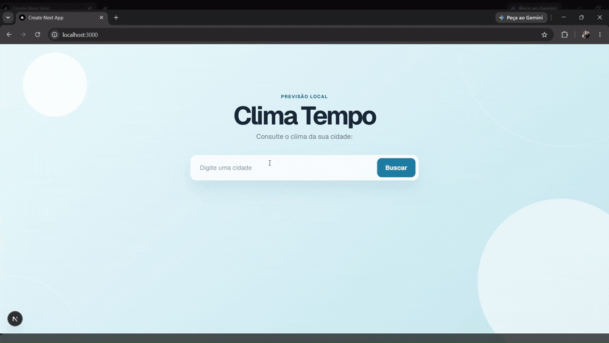

# Clima Tempo

Aplicação web para consultar a previsão do tempo atual de uma cidade de forma simples, rápida e responsiva.

O projeto permite buscar uma cidade e visualizar a temperatura, a umidade, a velocidade do vento e a condição climática atual.

> Este projeto continua em evolução. Novas funcionalidades e melhorias visuais serão adicionadas ao longo do desenvolvimento.

## Visualização do projeto



## Tecnologias utilizadas

- [Next.js](https://nextjs.org/) 16, com App Router
- [React](https://react.dev/) 19
- [TypeScript](https://www.typescriptlang.org/)
- CSS puro para a estilização da interface
- [Open-Meteo Geocoding API](https://open-meteo.com/en/docs/geocoding-api), para localizar a cidade
- [Open-Meteo Forecast API](https://open-meteo.com/en/docs), para consultar os dados meteorológicos
- Geist, carregada com `next/font`

## Funcionalidades atuais

- Busca de cidades
- Consulta da condição climática atual
- Exibição de temperatura, umidade e velocidade do vento
- Interface responsiva para desktop e dispositivos móveis
- Layout minimalista com foco na leitura das informações

## Como executar o projeto

### Pré-requisitos

- Node.js instalado
- npm instalado

### Instalação

```bash
npm install
```

### Ambiente de desenvolvimento

```bash
npm run dev
```

Abra [http://localhost:3000](http://localhost:3000) no navegador.

### Outros comandos

```bash
npm run lint   # verifica problemas de lint
npm run build  # cria a versão de produção
npm start      # inicia a aplicação em produção
```

## Estrutura principal

```text
app/
├── components/
│   ├── SearchCity.tsx
│   └── WeatherCard.tsx
├── types/
│   └── weather.ts
├── globals.css
├── layout.tsx
└── page.tsx
public/
└── preview.gif
```

## Próximos passos

Algumas possibilidades para a evolução do projeto:

- Tratamento de erros para cidades não encontradas
- Indicador de carregamento durante a busca
- Previsão para os próximos dias
- Exibição da localização encontrada
- Melhorias de acessibilidade e experiência do usuário

## Licença

Este projeto é destinado a fins de estudo e desenvolvimento.
